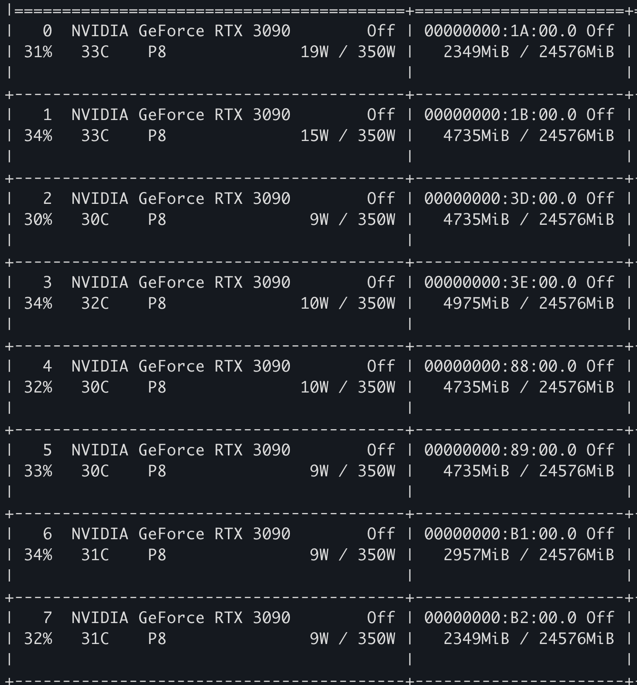
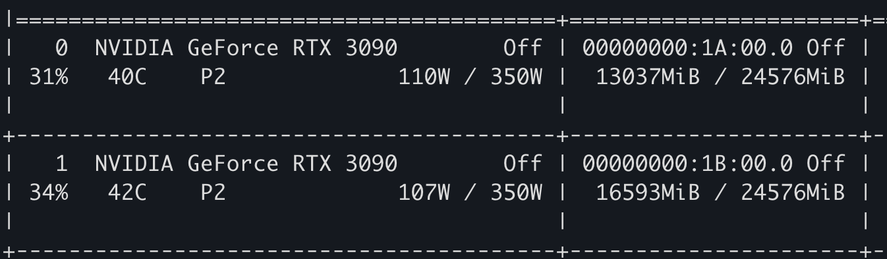
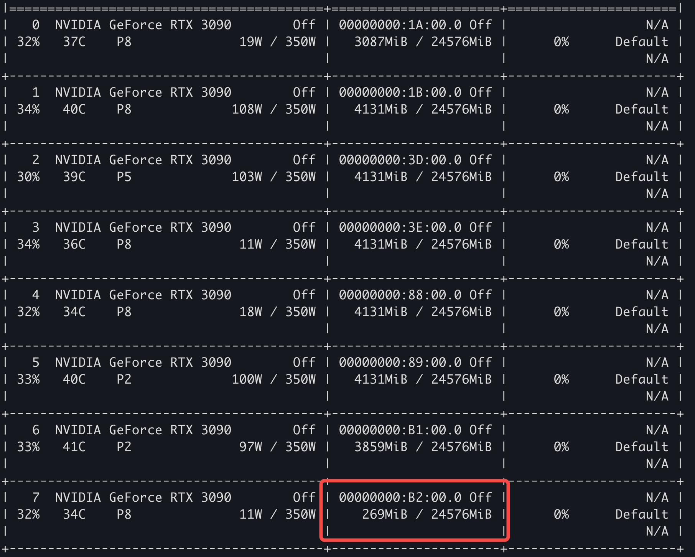

# lynkco-qa-assistant

## Task 1

加载模型，观察显存占用

- tokenizer 负责将输入切成 token，在 cpu 上运行，不在 gpu 上
- 加载模型时，如果指定 device_map 参数，根据模型默认配置，有可能会加载到 cpu 中

### Qwen2-7B

8 张卡, torch.float32, 共需要 30.7G 显存



2 张卡，torch.float32, 共需 28.9G 显存



1 张卡，torch.float32, 共需 19241MiB 显存，但是会报 Warning: Some parameters are on the meta device because they were offloaded to the cpu.

1 张卡，torch.float16, 共需 14.6G 显存

### Baichuan2-7B & Llama2-7B

显存占用基本和 Qwen2-7B 差不多，在多卡时，有可能显存分配比例不一样，比如 Llama2-7B 用 8 卡时，第 8 张卡只用了 254MB 显存，猜测应该是默认的 device_map 不一样。



模型加载到 gpu 上后，打印模型的加载情况，发现模型是每张卡上只放几个连续的层，而没有把一层拆开放到多张卡上


## Task 2

不同 batch size 下，推理时的显存占用如何？

- 8 卡推理，batch size 为 1 时，加载模型共用 31.6GB 显存，推理峰值 46.8GB 显存，推理总耗时 233 秒
- 8 卡推理，batch size 为 2 时，加载模型共用 31.6GB 显存，推理峰值 75.8GB 显存，推理总耗时 269 秒
- 8 卡推理，batch size 为 4 时，加载模型共用 31.6GB 显存，推理峰值 94.2GB 显存，推理总耗时 295 秒

尝试解释：因为我的提示词包括问题和已知的一些知识，长度在 2000-3000，我又设定了 decode 最多产生 60 个新 token，所以 prefill 阶段的计算强度很大，decode 阶段因为 batch pad 而变多，所以加大 batch 并不会让总时间变少。

不同数值类型，推理时的显存占用和速度对比如何？

- 8 卡推理，batch size 为 1 时，数据类型为 float32，加载模型共用 31.6GB 显存，推理峰值 46.8GB 显存，推理总耗时 233 秒
- 8 卡推理，batch size 为 1 时，数据类型为 float16，加载模型共用 16.9GB 显存，推理峰值 24.7GB 显存，推理总耗时 117 秒

float16 比 float32，显存少用 50%，速度提升一倍

1. 不同模型的得分差异？
2. float32 和 float16 的得分差异、延迟差异、吞吐差异？

不同模型对比，得分高低如何？(2 卡)

- Qwen float16 0.2411 110s
- Qwen float32 0.2410 229s
- Baichuan float16 0.5280 746s
- Baichuan float32 0.5259 1516s
- Llama float16 0.3147 306s
- Llama float32 0.3145 856s

## GPU Metric 可视化

```
docker network create gpunetwork
```

```
docker run -d --network=gpunetwork --name gpuexportor \
    --gpus all --cap-add SYS_ADMIN --rm -p 9400:9400 \
    nvcr.io/nvidia/k8s/dcgm-exporter:4.3.1-4.4.0-ubuntu22.04
curl localhost:9400/metrics
```

```
mkdir -p /mnt/nvme2/prometheus/{data,config,rules}
chmod -R 777 /mnt/nvme2/prometheus/data
chmod -R 777 /mnt/nvme2/prometheus/config
chmod -R 777 /mnt/nvme2/prometheus/rules

cat > /mnt/nvme2/prometheus/config/prometheus.yml << \EOF
global:
  # 数据采集间隔
  scrape_interval:     15s
  # 告警检测间隔
  evaluation_interval: 15s

# 告警规则
rule_files:
  # 这里匹配指定目录下所有的.rules文件
  - /prometheus/rules/*.rules

# 采集配置
scrape_configs:
  # 采集项(prometheus)
  - job_name: 'prometheus'
    static_configs:
      # prometheus自带了对自身的exporter监控程序，所以不需额外安装exporter就可配置采集项
      - targets: ['localhost:9090']
  - job_name: 'gpus'
    static_configs:
      - targets: ['gpuexportor:9400']
EOF

docker run -d --network=gpunetwork --name prometheus \
    -p 9091:9090 \
    -v /mnt/nvme2/prometheus/data:/prometheus/data \
    -v /mnt/nvme2/prometheus/config:/prometheus/config \
    -v /mnt/nvme2/prometheus/rules:/prometheus/rules \
    docker.1ms.run/prom/prometheus:v2.41.0 --config.file=/prometheus/config/prometheus.yml --web.enable-lifecycle
```

```
mkdir -p /mnt/nvme2/grafana/{data,plugins}
# 授权相关文件夹权限
chmod -R 777 /mnt/nvme2/grafana/data
chmod -R 777 /mnt/nvme2/grafana/plugins

# 环境变量GF_SECURITY_ADMIN_PASSWORD：指定admin的密码
docker run -d -p 3000:3000 --name=grafana --network=gpunetwork \
    -v /mnt/nvme2/grafana/data:/var/lib/grafana \
    -v /mnt/nvme2/grafana/plugins/:/var/lib/grafana/plugins \
    -e "GF_SECURITY_ADMIN_PASSWORD=123456" \
    docker.1ms.run/grafana/grafana:9.3.2
```
